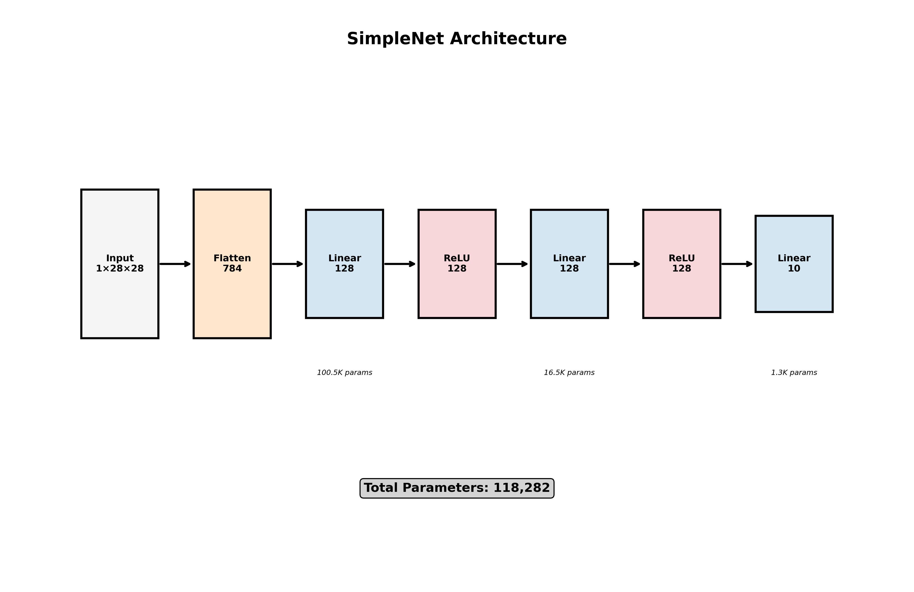

# MNIST画像認識チュートリアル

PyTorchを使ったMNIST手書き数字認識のチュートリアルです。

## ファイル説明

- `mnist_pytorch.py`: 完全版（可視化機能付き）
- `simple_mnist.py`: 簡易版（基本的な学習と評価）
- `auto_network_diagram.py`: ネットワーク構造自動可視化ツール
- `visualize_network.py`: torchvizを使った詳細計算グラフ可視化

## 必要なライブラリ

```bash
pip3 install torch torchvision matplotlib numpy torchviz graphviz
```

macOSでの追加セットアップ：
```bash
brew install graphviz
```

## 実行方法

### 簡易版
```bash
python3 simple_mnist.py
```

### 完全版（可視化付き）
```bash
python3 mnist_pytorch.py
```

### ネットワーク構造可視化
```bash
python3 auto_network_diagram.py
```

## 結果

簡易版で1エポック訓練後、テスト精度約90%を達成しました。

## モデル構造

### SimpleNet（基本的な全結合ニューラルネットワーク）



- 入力層: 784ユニット（28x28画像）
- 隠れ層: 128ユニット × 2（ReLU活性化）
- 出力層: 10ユニット（0-9の数字分類）
- 総パラメータ数: 118,282

### CNNNet（畳み込みニューラルネットワーク）


- Conv2d(1→32) + ReLU + MaxPool2d
- Conv2d(32→64) + ReLU + MaxPool2d  
- Flatten + Linear(3136→128) + ReLU + Dropout
- Linear(128→10)
- 総パラメータ数: 1,199,882

## ネットワーク構造可視化機能

このプロジェクトには、任意のPyTorchモデルから自動的にネットワーク構造図を生成する汎用的な機能が含まれています：

- **自動レイヤー検出**: モデルの構造を自動解析
- **レイヤータイプ別色分け**: Conv2d、Linear、ReLUなど種類ごとに色分け
- **パラメータ数表示**: 各レイヤーと総パラメータ数を表示
- **複数形式対応**: PNG/SVG形式で出力

使用例：
```python
from auto_network_diagram import create_auto_network_diagram

# 任意のPyTorchモデルで使用可能
model = YourModel()
create_auto_network_diagram(model, input_shape=(1, 28, 28), save_name="your_model")
```